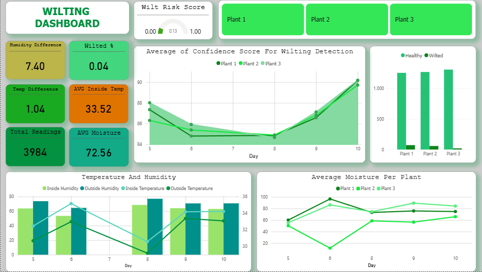

# 🌱 IoT Plant Wilting Detection Dashboard

An **end-to-end data analytics pipeline** that collects environmental
sensor data from IoT devices, processes it through an automated ETL
workflow, stores it in a relational database, and visualizes plant
health insights through an interactive Power BI dashboard.

This project demonstrates **data engineering, ETL orchestration, and
business intelligence visualization** using real-time environmental
telemetry.

------------------------------------------------------------------------

# 📊 Dashboard Preview

The dashboard monitors plant health indicators such as:

-   Humidity Difference
-   Temperature Difference
-   Average Soil Moisture
-   Wilted Percentage
-   Confidence Score Trend
-   Plant Health Distribution

------------------------------------------------------------------------

# 🏗 System Architecture

The pipeline follows a **layered data architecture** commonly used in
modern analytics systems.

  -----------------------------------------------------------------------
  \#                Layer             Technology        Responsibility
  ----------------- ----------------- ----------------- -----------------
  01                Sensor Layer      DHT22 /           Captures
                                      Capacitive Soil   temperature,
                                      Moisture Sensor   humidity, and
                                                        soil moisture

  02                Edge Layer        ESP32             Aggregates sensor
                                      Microcontroller   readings and
                                                        transmits via
                                                        HTTPS

  03                Ingestion Layer   Google Sheets +   Receives and logs
                                      Apps Script       raw telemetry

  04                Extraction Layer  Google Sheets API Programmatic data
                                      v4                access

  05                Orchestration     Apache Airflow    Schedules and
                    Layer                               monitors ETL
                                                        pipelines

  06                Transformation    Python (Pandas,   Cleans and
                    Layer             NumPy)            transforms data

  07                Storage Layer     Microsoft SQL     Stores structured
                                      Server            analytical data

  08                Visualization     Microsoft Power   Interactive
                    Layer             BI                analytics
                                                        dashboard
  -----------------------------------------------------------------------

------------------------------------------------------------------------

# 🔄 Data Pipeline Flow

Physical Sensors\
↓\
ESP32 Microcontroller\
↓\
Google Sheets (Apps Script Logging)\
↓\
Google Sheets API\
↓\
Apache Airflow DAG\
↓\
Python ETL Processing\
↓\
Microsoft SQL Server\
↓\
Power BI Dashboard

------------------------------------------------------------------------

# ⚙️ Technologies Used

## Data Engineering

-   Python
-   Pandas
-   NumPy
-   Apache Airflow
-   Google Sheets API

## Data Storage

-   Microsoft SQL Server

## IoT Hardware

-   ESP32
-   DHT22 Sensor
-   Capacitive Soil Moisture Sensor

## Visualization

-   Microsoft Power BI
-   DAX

------------------------------------------------------------------------

# 📁 Project Structure

    iot-wilting-dashboard
    │
    ├── dags
    │   └── sensor_etl_pipeline.py
    |
    ├── dashboard_image
    │   └── dashboard image.png
    │
    ├── extract
    │   ├── __init__.py
    │   ├── google_sheets_extractor.py
    │   
    │
    ├── load
    │   ├── __init__.py
    │   ├── sqlserver_loader.py
    │
    ├── powerbi_file
    │   └── project1.pbix  
    |
    ├── sql
    │   └── schema.sql
    |
    ├── test
    │   ├── conftest.py
    │   ├── test_extract.py
    |   |__ test_load.py
    |   |__ test_transfrom.py
    |
    ├── load
    │   ├── __init__.py
    │   ├── plant_transformer.py
    │
    ├── config.py
    |
    └── docker-compose.yml
    |
    └── Dockerfile
    |
    └── logger.py
    |
    └── README.md
    |
    └── requirements.txt
    |
    └── run_local.py

------------------------------------------------------------------------

# 📈 Dashboard Features

### Metrics

-   Humidity Difference
-   Temperature Difference
-   Average Moisture
-   Total Sensor Readings
-   Wilting Percentage
-   Average Confidence Score

### Visualizations

-   Wilting Risk Gauge
-   Confidence Score Trend
-   Plant Health Distribution
-   Environmental Indicators

------------------------------------------------------------------------

# 🚀 How to Run the Project

### 1. Clone the Repository

    git clone https://github.com/markjohnmerana/iot-wilting-dashboard.git
    cd iot-wilting-dashboard

### 2. Install Dependencies

    pip install -r requirements.txt

### 3. Configure Google Sheets API

Add credentials:

    credentials/google_service_account.json

Environment variables:

    GOOGLE_SHEET_ID=your_sheet_id
    GOOGLE_SHEET_NAME=Sheet1

### 4. Configure SQL Server

    SQL_SERVER=localhost
    SQL_DATABASE=iot_sensor_db
    SQL_DRIVER=ODBC Driver 17 for SQL Server

### 5. Start Airflow

    docker-compose up

Trigger the DAG using the Airflow UI.

------------------------------------------------------------------------

# 🎯 Project Goals

This project demonstrates:

-   End-to-end **data pipeline architecture**
-   **IoT data ingestion**
-   **Automated ETL orchestration**
-   **Data warehouse integration**
-   **Interactive analytics dashboards**

------------------------------------------------------------------------

# 📌 Future Improvements

-   Real-time streaming with MQTT or Kafka
-   Cloud deployment (AWS or GCP)
-   Machine learning model for wilting prediction
-   Automated alerting system

------------------------------------------------------------------------

# 👨‍💻 Author

**Mark John**\
Data Analytics & Data Engineering Enthusiast
View my works here:
https://engr-insight.netlify.app/
